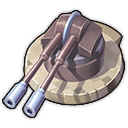
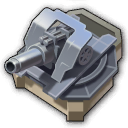

# Military Attention | 1.21!

A mod centered around military infrastructure and adding new military residence tiers for all regions with a focus on the Old World.

## Changelog

### v1.21
Fixed norm materials and other graphic mistakes for
- Canteen (OW + EN)
- Cigarettes factory
- Cardgames Factory
- Military Academy
- Military Prison
- Military Training Complex
- Propaganda Facility
- Recreation Centre
- Ammunition Factory (Basic, Shell, Bombs)
- Heated Military Uniform Factory
- Sleeping Bags Factory
- Ammunition Depot (Normal and Large)
- Gunpowder Factory

### v1.20
- Changed name of the folder and name of the mod and category. Make sure to delete the old one if you install it manually.
- Weapons Factory - Cycletime from 90s to 45s to boost early production a bit.
- Open pit maintenance and building costs reduced.
- Added open pit mines to shared open pit pool so for example the Mineralogist also affects the open pit mines.
- If Jakob Biogas mod is installed, fire towers and ammunition depots will be unlocked at 500 engineers.

### v1.19
- Added AI production buildings like bombs ammunition factory into the correct unlocks so they are only making them when they actually fit the time. 
- Added a cheaper kiosk recruitment office for early game that uses normal worker workforce and is smaller but produces sailors slower.
- Added AI recruitment office for the New World, so AI is actually able to also make ships in the New World.
- Added the correct building model for the nitrary with fields for AI. But still without the shed.
- Replaced care packages with clean water and lowered the amount of goods for construction of schooner and gunboat to make ship building at the beginning easier.
- Added clean water pump for AI so thet have clean water to make ships early
- Made additional sailingships construction costs a bit cheaper to make ship building at the beginning easier.
- Rebalance price for Care Packages and Saltpetre.
- Remove construction cost of steel beams for the Canteen in all regions to kickstart soldiers a bit more.
- Made normal Recruitment Offices not available for AI so they will not build them and get stuck not producing soldiers.
- Reduced amount of fields of farms for other mods to be in line with the logic of vanilla reduction (Kurila (Herbs OW), Jakob (Olives (OW), Vegetables (OW), Hemp (OW), Flax (OW)), Drakkam (Tomatoes OW), Taludas (Avocados (NW)) mods).
- Change newspaper trigger to 150 workers when unlocking soldiers instead of at farmers.
- Rebalanced amount of buildings that AI make and made it more simple to be flexible and less chance of problems.
- Added Military Uniforms chain to the consumables construction category which was missing.
- Rebalance defense buildings.
- Add additional construction cost of care packages and sailors to correct diving vessel.
- Lowered the unlocks for soldiers from 300 to 200 soldiers and 500 to 400 soldiers.

### v1.18
- Hide vanilla turrets in harbour menus instead of removing them. Now should be more compatible with other mods.
- Added new harbour defenses to normal harbour menu to find them more easily when used to the normal location.
- Removed the removal of the cannon chain in the workers menu, so people can also find the chain there like they are used to.
- Changed AttackableType for the Canteen so it will not randomly be attacked by ships.
- Bombs and shells ammunmition are now unlocked for AI a bit later at the moment they can actually start using them.
- Added a lot more triggers that unhide stuff so you can more easily see what is coming and what you need to do to unlock it.

### v1.17
- Fixed AI building military postbox over and over again. AI do not build it anymore.
- Cut out Open Pit Mines from Military Attention. It can now also be downloaded as a standalone mod. It is still included in this mod. But no need to install both mods if you have this mod.
- Disabled open pit mines also for AI to make sure they not bug out AI.
- Added a pool for All Cemeteries
- Added additional unlocks for input goods (saltpetre/gunpowder) for cannons/weapons related production chain to also unlock with workers and not only with soldiers.

### v1.16
- Additional support for new Imperio Shipyard ships (Frachter Imperio Liner, Viktoria Luise, Kleiner Schlepper mit Lastkahn)
- Additional support for 1905 - Trans-Ocean Liner

### v1.15
- Added buildings to alternative construction menu
- Rebalance amount of goods AI produce
- New icons for Cemetery and Military Warehouse
- Nerfing AI behaviour even more for dropping goods.
- Added compatibility for Jakob Compact Menu again, but in a correct way now.
- Additional fixes to make sure the mod works correctly when CO is installed
- Text fixes

### v1.14
- Fixed bug in code for pools
- Fixed bug with shared Galena good mod

### v1.13
- Added newest version of shared pools and definitions
- Added newest version of galena shared good
- Added fake AI factory so AI makes cannons more easily
- Rebalanced amount of factories AI make, the fake factories itself and the output of fake factories for AI
- Removed potential compatibility with Jakob Compact menu because not working at the moment and generating warnings in log
- Added additional pools for all basic weapons factory and all military uniform factories
- Added All basic weapons factories and All Military Uniforms factories to more vanilla pools to be used with more items (All Heavy Production, All Ironworks and Foundries, The Cutting Edge)
- Cleanup pools by combining some buildings into an existing pool for easier management

### v1.12
- Refreshed trigger GUIDs for 1 soldier and 100 soldiers unlock
- Added buff to churches when building a cemetery next to a church. Added also compatibility for Lion Old World Chapel mod for this.
- Added compatibility for Pescatarians mod by adding some needs from MA to the Pescatarians population
- Increased the amount of soldiers you get from early game goods a small bit to get some more soldiers early game

### v1.11
- Updated Chinese translation thanks to hanthe2th
- Added compatibility checks for Lifestyle needs so they are more compatible with other mods that change lifestyle needs
- Fixed wrongly unlock condition for Field Hospital
- Added additional population for Engineers and Investors in line with the additional population for farmers, workers and artisan so when upgrading you do not loose population.

### v1.10
- Update for Simplified Chinese translation
- Added new item Sammy Moray - replacing arctic gas with ethanol for Gas Ammunition depots and Gas-Fired Power Plant. Added compatibility for mod "Additional Power Plants"
- Fixes to All ammunition depots pools
- Cleanup for product storage lists

### v1.9
- Added Soldiers workforce to free island workforce from "World Leaders" buff
- Changed the effect to only steam shipyard from both shipyards for "Pyrphorian Ship Blueprints" Military Academy itemset
- Added Mourning at sea building a cemetery building when Harborlife is installed so people in harbour also have a cemetery building
- Fixes to text/descriptions

### v1.8
- Added compatibility for Icebreaker ship mod from EvametryE
- Fixed decals of military ornaments
- Open Pit Coal mine now has a cycletime of 15s instead of 30s helping with that hight coal consumption
- Fixed prison and propagande buff so they can no longer stack multiple times on residences
- Added an additional variation for the Military Postbox. 
- Removed additional building costs for Combat Overhaul ships because the author did not want them anymore
- Added All shipyards to military logistics item set buff
- Added some additional code so AI would not use certain needs for soldiers
- Added some additional compatibility for recruitment offices in all regions
- Fixed the unlock for the Old World Sleeping bag factory
- Added additional building costs for pirate ships
- Some code comment changes

### v1.7
- Added fake production buildings for nitrary and gunpowder for the AI to make sure they produce the goods and do not get stuck in their progression.
- Fixed the fake Shell Ammunition factory for AI which they did not build resulting in not making more advanced ships because they did not have Shell ammunition.
- Added ignores for new needs for AI to make sure they do not get stuck on those needs when not building them.
- Rebalanced ConstructionMaterials for AI a bit and added some additional goods like weapons/cannons, advanced weapons, sails and steam motors.
- Added a fix that should not keep AI from progressing in the Old World when Cape is available

### v1.6
- Added Furnace, Basic Weapons Factory, Military Uniforms Factory, Canned food and Care Packages to the New World so you can make that in that region.
- Made the Military Headquarters a separate unique building type to make sure it is compatible with other mods that reused the Hacienda unique type. Now Mod12 is used.
- Added compatibility for 1805 - Ships of the Line - Flagship Edition
- Added new buildings (Military Uniform Factory, Open Pit Mines, Basic Weapons Factory,...) to specialists and pools
- Added compatibility for "Military Attention - No Vanilla Changes" to revert certain changes back to vanilla values (for example the farmfields changes)
- Copy fixes

### v1.5
- Fixed Spanish translations

### v1.4
- Added translations for all missing languages thanks to automatic translations from Nyk
- Added Polish manual translation thanks to sollzoren
- Included rebalance changes that would have been in New Horizons. Some of the Military centered changes are taken out of New Horizons and included in this mod. (Rebalance defense buildings)
- Fixed first unlock in New World for Soldiers
- Cleanup .glb files and other assets that are not needed
- Added Open Pit Iron Mine and Open Pit Coal Mine for the New World. Will be expanded upon in future updates.

### v1.3
- Made clean water less valuable

### v1.2
- Added public services buildings like cemetery, canteens,... to All Public Servies pool so items that effect those effect those buildings
- Added cemetery and local cemetery to be affected by multiple existing items
- Added additional buildings and needs to existing items
- Fixed wrongly shown unlock condition for the Military Academy from 2000 soldiers to 2000 engineers
- Increased maintenance costs for all defense buildings
- Reorganised/Cleanup unlocks/triggers for military buildings in Arctic, New World and Enbesa region
- Rebalanced/increased all consumption amount for all soldier tiers and the additional needs for vanilla tiers. Before it was way to low.
- Added compatibility for Additional Oil Tankers from 0skater0
- Added compatibility for Large Tourism Ship [Spice It Up]
- Added compatibility for Buildable Salvagers [Spice It Up]
- Added compatibility for Flagship Armed Great Eastern (Serp)
- Added Open Pit mines again for AI, so they progress past workers again. Before they were stuck and did not progress to Artisans.
- The Fort is now another unique type to make sure there is compatibility with other mods. If you have a fort already it will be swapped to the new unique type. If you are in the process of building one this is still registered under the old unique type and you will be able to build another one. New savegames will only be able to build the new type.
- Cleaned up a lot of the product lists so less goods are double in the marketplace goods
- Added the new ornaments to their own category
- Global cleanup of not used code (quests, festivals,...)

### v1.1
- Fixed wrong exchange values for Horses, clean water, lead and gunpowder in Docklands
- Removed the changes to Bruno Ironbright
- Changes to existing translations
- Added French translation thanks to Khobs
- Removed not used radius from HQ and fixed the visibility of the streetrange for the public service
- Fixed decal Canteen Enbesa
- Fixed moodtext for Arctic Soldiers to represent the heat like other Arctic residences

### Beta v0.16
- Changed ParticipantMessageArcheType for some of the production buildings which was not correct with the actual workforce it used
- Fixed wrong materials for Old World Ammunition Depots
- Changed building costs for Military Academy
- Fixed some wrong descriptions and images/icons
- Added compatibility for 1805 - Ships of the Line
- Fixed decal canteen Enbesa

### Beta v0.15
- Fixed compatibility for Old Town (Fishboss)
- Fixed decal for Military Training Facility
- Added Buildings to pool of all weapons production
- Changed the BasePrice for Care Packages from 10000 to 150
- Nerfing dropgoods reputation gain and cooldown when dropping care packages and water on AI
- Moved Gunpowder, Clean Water, Galena, Lead and Horses to a shared good to use by everyone who wants it
- Fixed some region product changes to Sleeping Bags

### Beta v0.14
- Changed menu icon for Clean water pump
- Changed name of Militairy contstruction menu to soldiers contrusction menu to be in line with the other categories focused on the population tier
- Fire towers and large ammunition depots in all regions can now only be build when reaching Arctic gas with 750 technicians.
- Military Prison is now unlocked at 500 engineers and not at 1000 soldiers because you need concrete for it
- Rearranged some buildings in the soldiers building menu
- Added extra compatibility for Combat Overhaul
- Fixed a bug where the Sanitation facility could make the game crash when a cart from the Nitrary shed was picking up dung there
- Fixed some floating props for the stable fields
- Fixed Enbesa encampment which was incorrectly a New World encampment
- Added recipe background visuals for ammunition factories and depots
- Balanced maintenance costs for a lot of buildings
- Balanced cycletime for a lot of buildings
- Balanced consumption for all soldier tiers
- Added/changed lifestyle needs for soldiers in all regions
- Reduction of farmfields all farms in all regions to make some more space for soldier residences and extra production buildings
- Unlocked bombs together with Old World Bombs factory
- Rearranged order of workforce for soldiers in top menu to be the same for all regions
- Added a radius to the Clean Water Pump so you can not build them next to eachoter. Thanks to hanthe2th for the idea
- Fixed the shooting of the fort and balanced it a bit more

### Beta v0.13
- Now full support for Creative mode
- Fix for "Come What May" campaign quest
- Fix for description text nitrary bed
- Fixed some feedback for the Fort
- Fixed multiple norm maps for new military buildings so buildings now have a better visual representation
- Models for Navy Recruitment Offices for Enbesa and Arctic
- Reduced the radius for Enbesa, New World and Arctic Navy Recruitment Office
- Finalised model with feedback for Military Headquarters and added extra variation
- Added multiple buildings to multiple effect pools so most of the buildings can be influenced by items from the game
- Added 4 new items. One for Cardgames Factory, All food production, Dynamite Factory and Mint
- Added German translations thanks to f0kx
- Added Chinese translations thanks to hanthe2th
- Removed some basic code for Expeditions. Will never be developed in the end
- Added Clean Water, Paper, Sleeping Bags and Advanced Weapons to Docklands traders
- Fixed descriptions for ornaments
- Added Military street you can build via the military headquarters like haciends paving

### Beta v0.12
- Added fort feedback units and optimised the models for the different stages
- Added shared scroll hint (Kurila) to be compatible with other mods adding goods that could overflow the ui for residents
- Changed name of Weapons and corresponding buildings and chain to Cannons.
- Replaced additional output for Master Craftsman Franke with Military Uniforms
- Replaced additional output for Mariana the Master Stylist with Military Uniforms
- Changed additional output for Bruno Ironbright, Engineering Giant and added Basic Weapons
- Add Open Pit Mines to All Old World Mines pool
- Open Pit Mines can no longer be affected by electricity
- The cycletime for Open Pit Mines has been increased to nerf them a bit
- Balanced Military Logistics buff
- The cycletime for Military Prison and Propaganda Center is now lower
- Now actually fixed Nitrary module so it is compatible with Extended Tractors (Kurila)
- Military Academy
    - Reduced the maintenance costs
    - New model with feedback
    - Modules have a complete rework. They are now campuses you can place all around your island to boost productivity and increase researchpoints for Engineers and scholars. You can also slot 3 items in there! Only one is shown in the Academy UI sadly because the UI does not allow it.
- Added Military Warehouse for New World, Enbesa and Arctic regions

### Beta v0.11
- Moved compatibility for Extended traktors (Kurila) to compatibility file
- Added compatibility for Pet needs for residents
- Added horses as a lifestyle need for New World ann Enbesa Soldiers
- Moved Coffee to happiness needs for Soldiers Old World
- Added Advanced Weapons to needs Soldiers Old World
- Added Clean Water production for Old World and New World
- Added Clean Water as a need for Farmers, Workers and Jornaleros
- Removed Beef and Jam from Lifestyle needs Old World Soldiers
- Changed and big cleanup recipes for Care Package Factory with other inputs and more balanced production and added feedback
- Added feedback units and extra assets to Open Pit iron and coal mine and some cleanup.
- Fixed some correct portraits for production buildings to worker portrait instead of soldier portrait
- Added Open Pits to Mines and Quarries pool

### Beta v0.10
- Added horse sound to stables, horse training ground and fields
- Fixed some feedback from the Propaganda Facility
- Barracks
    - Added feedback
    - Added more lod's foor zoom levels
    - Upgrading to barracks is now like upgrading to the next tier, not via skyscraper mechanic
- Removed Military Engineers and all its additional things like pools, assets,...
- Changed and inscreased workforce from engineers to soldiers for
    - Small Bombs Ammunition Depot (OW)
    - Large Ammunition Depot (OW)
    - Military Warehouse
    - Military Academy
    - Ammunition Factory - Bombs
- Corrected Military Prison buff
- Military ornament 1
    - Removed grass variation
    - Fixed material of sign
- Ammunition Depots
    - Added feedback
    - Fixed adjust to terrain
    - Fixed decals
- Nerfed soldiers and income for soldier needs, happiness needs and lifestyle needs
    - Coins from 60 to 30
    - Cigarettes from 20 to 15
    - Recreation Center from 50 to 30
    - Beef from 25 to 15
    - Jam from 25 to 10
    - Cardgames from 40 to 30
    - Huskies from 20 to 15
- Nerfed amount of happiness for all Soldiers goods to balance it more with the vanilla values of max 20
- Added Barracks for soldiers to the Arctic as upgrade for Arctic encampments
- Changed some of the Arctic Soldier needs/heat/lifestyle to balance with the new arctic barracks
- Small temporary fix for compatibility with Extended Traktors (Kurila)

### Beta v0.9
- Rebalance Military Logistics Buff from 50% productivitey to 40%. Increased extra workforce and maintenance from 15% to 20%.
- Added Gunpowder as input for weapons
- Added Mod1 to socket allocation for Military Academy Module items so there is compatibility with Items Sockets mod from Kurila
- Cemetery is moved and unlockable at Artisans now instead of engineers. 
- Small fix for adapt to terrain height for pallisade gate
- Added new model/visual and materials for standard military soldiers thanks to S1LV3R-p0tat0.
- Cleanup, fixing materials and adding feedbackunits for:
    - Galena Module
    - Dung Collector
    - Stables + Training ground
    - Nitrary + Shed + Fields
    - Canteen (OW, NW, EN)
    - Recreation Center
    - Propaganda Facility
    - Naval Recruitment Office
    - Sanitaion Facility
    - (Small) Military Warehouse
    - Military Prison
    - Military Postbox
    - Military Training Complex
    - Military Field Hospital
    - Military Uniform Factory
    - Heated Military Uniform Factory
    - Military Mailbox
    - Military Outpost (NW, EN, AR)
    - Mint
    - Cardgames Factory
    - Cigarettes Factory
    - Sleeping Bag Factory
    - Gunpowder Factory
    - Basic Weapons Factory
    - Basic Ammunition Factory
    - Shell Ammunition Factory
    - Bombs Ammunition Factory
    - Encampments (OW, NW, EN, AR)

### Beta v0.8
- Corrected NoSatisfactionDistance and NoSatisfactionDistance for depots and other public services
- Added feedbackunits to all Old World Encampments for soldiers
- Revamped some aspects of the Old World Encampments (Tents, props,...)
- Added extra pallisade and non pallisade variations for Old World Encampments
- Added a wall with gate pallisade system to beauty build in the Old World and the New World

### Beta v0.7
- Added jakob-skyscraper-button to make the skyscraper unlock button available earlier for the barracks instead of at 5000 investors
- Check all itemsets from Academy and fixed some bugs with it
    - Itemset 1 - Ship Production - Correctly added Pirate Naval Architect Blueprints
    - Itemset 2 - Military Consumption Goods Production 
        - changed Pirate Naval Architect Blueprints to correct item Jean's Best Whisky
        - Removed not needed Coffee roaster from region that is not affected
    - Itemset 3 - Military Equipment Production - Added Heated Military Uniform Factory
    - Itemset 4 - Military Weapon Goods Production - Added Basic Weapons Factory to Military Weapon Goods Production pool
    - Itemset 7 - Speed Improvements Ships - Corrected the Cargo slowdown from +50% to -50%
    - Itemset 10 - Speed Improvements Airships - Corrected the Cargo slowdown from +75% to -50%
    - Itemset 12 - Defense Improvement Airships - Corrected the Damage slowdown from +75% to -50%
- Fixed Buff given by Fort to surrounding harbour buildings - If you already have build this, you probably need to make a move action for all buildings affected by this to reset the buff.
- Added defense turrets from the mod to vanilla all defense turrets pool
- Changed icon Jean's Private Messenger
- Changed standard workforce for ammunition factories to workers and not soldiers
- Changed Soldiers workforce goods product list that was actually not used to SoldiersConsumerGoods for every region
- Changed workforce for Mint from workers to artisans
- Moved Meat from Needs to Lifestyle needs for Old World soldiers
- Added Pocket Watches to upgraded Old World Soldiers as happiness need
- Moved Military Academy from Luxury needs to normal needs for Military Engineers
- Cleaned up and restructured a lot of the ProductLists
- Fixed double amount in storage for some products
- Moved Military Training Complex in the construction menu
- Removed the bus icons from Military Academy and Fort monument in the construction menu by changing the templates for Military Academy and Fort preparations

### Beta v0.6
- Added correct costs and maintenance for Fort monument
- Reduced the range from 90 to 80 for the Cemetery
- Made Open Pit mines unavailable for AI because they take to much space and AI does not build any normal mines anymore
- Added compatibility for Nate's Airship (Spice It Up)
- Added Field Hospital building
- Added Field Hospital as a need for Soldiers
- Balanced the SupplyWeight of soldiers for certain products
- Moved Military Headquarters to barracks residence
- Fixed output for Military Prison
- Fixed output for Propaganda Facility
- Made the Cemetery model a bit wider

### Beta v0.5
- Added ormaments (Memorial statues (2 variations), Cannon statue)
- Removed Potatoes from needs Farmers and Workers
- Added Cemetery need for Farmers, Workers and Artisans
- Added Local cemetery and Cemetary public service building (2 variations Local cemetery, 3 variations Cemetery)
- Add Basic ammunition to OfferingGoods Archibald and Isabel
- Add Basic weapons and Basic ammunition to OfferingGoods Anne and Jean
- Add Galena to OfferingGoods Eli
- Changed BasePrice and ExpeditionAttributes for some of the products that I forgot.

### Beta v0.4
- Added compatibility for ships Old Town (Fishboss)
- Added compatibility for Almost 100 hot air balloons (Hier0nimus)
- Added Stables to all animal farms pool
- Added Military Uniform Factory, Sleeping Bag Factory and Heated Military Uniform Factory to All Cloth Industries pool
- Added residences in all regions to residences pools
- Change the order of some buildings in the construction menu
- Increased radius for small and large ammunition depots

### Beta v0.3
- Increased service range stables so it can be reached further for a warehouse
- Reduced building costs, cycletime and workforce maintenance for Care packages factories
- Added building costs for Military Prison and Propaganda Facility
- Increased cycletime for Military Prison and Propaganda Facility
- Balanced Maintenance costs Military Prison and Propaganda Facility
- Added additional description for Military Prison and Propaganda Facility to make it more clear what they do
- Moved Enbesa Soldiers mail to compatibility file. Now only loaded when Hackner's Enbesa Mail mod is installed. Otherwise no mail possible in Enbesa.
- Added all SocketAllocation types for Military Academy module
- Removed negative attractiveness for military encampments
- Fixed radius when placing empty small ammunition depot
- Fixed upgrade arrow for Navy Recruitment Center

### Beta v0.2
- Removed not needed material .png files which reduces the total file size of the mod a lot
- Changed GUID for trigger 300 soldiers to make sure changes of Flak Emplacement are triggered
- Galena output from 1/2 to 1/1 to make sure there is enough output early game
- Fix Small Military Warehouse, now working correct. Crashes the game before
- Removed building costs of bricks and increased the cost of timer from 20 to 25 for Iron and Coal Open Pit mines to make it easier and more accessible to build
- Reduced the output cylce time for Open Pit Coal Mine from 30s to 15s
- Reduced the output cycle time for Open Pit Iron Mine from 60s to 30s
- Reduced workforce from 100 to 20 soldiers for the Military Training Complex 
- Changed adding all defense buildings different way
- Fixed the Flak Emplacement and Land Flak Emplacement
- Added Care Package Factories to All Military Production Buildings pool which is used by different pools and buildings
- Add Lead Smelter to the All Ironworks and Foundries 
- Reduced the damage done by the Flame Tower to wooden ships
- Fixed status icon for Military Prison in the model

## New population tiers

Added a new population tier at the construction menu called soldiers. This is done for every region.

Within those menus a lot of new buildings are available. With a focus on the Old World but also the New World, Arctic and Enbesa got some basic military love.

### Soldiers (Old World, New World, Enbesa, Arctic)

Adds a new soldiers population tier as extra workforce in every region.

## New (military) buildings

### Residence Buildings

- Encampment (Old World, New World, Enbesa, Arctic)
- Barracks (Upgraded variant of encampment for Old World and Arctic soldiers)

### Public Services

|     |  |
| -------- | ------- |
|   | Cemetery |
|   | Canteen (Old World, New World, Enbesa) |
|   | Field Hospital |
|   | Sanitation Facility |
|  | Navy Recruitment Office  |
|  | Military Headquarters  |
|  | Military Outpost (New World, Enbesa, Arctic)  |
|  | Recreation Center  |
|  | Military Training Complex  |
|  | Military Post Box  |
|  | Propaganda Facility  |
|  | Military Prison  |
|  | Military Academy  |

### Production Buildings
|     |  |
| -------- | ------- |
|  | Stables  |
|  | Clean Water Pump  |
|  | Open Pit Iron Mine  |
|  | Open Pit Coal Mine  |
|  | Military Uniform Factory  |
|  | Basic Weapons Factory  |
|  | Care Package Factory  |
|  | Galena Module  |
|  | Lead Smelter  |
|  | Mint  |
|  | Paper Factory  |
|  | Cardgames Factory  |
|  | Cigarettes Factory  |
|  | Dung Collector  |
|  | Nitrary  |
|  | Gunpowder Factory  |
|  | Ammunition Factory (Basic)  |
|  | Ammunition Factory (Shell)  |
|  | Ammunition Factory (Bombs)  |
|  | Sleeping Bag Factory  |
|  | Heated Military Uniform Factory  |

### Logistic Buildings
|     |  |
| -------- | ------- |
|  | Small Ammunition Depot (Basic) (Old World, New World, Enbesa, Arctic)  |
|  | Small Ammunition Depot (Shell) (Old World, New World, Enbesa, Arctic)  |
|  | Small Ammunition Depot (Gas) (Old World, New World, Enbesa, Arctic)  |
|  | Small Ammunition Depot (Bombs) (Old World, New World, Enbesa, Arctic)  |
|  | Large Ammunition Depot (Old World, New World, Enbesa, Arctic)  |
|  | Small Military Warehouse  |
|  | Military Warehouse  |

### Defense Buildings
|     |  |
| -------- | ------- |
|  | Fort |

## New Goods
|     |  |
| -------- | ------- |
|  | Horses  |
|  | Clean Water  |
|  | Military Uniforms (Wool + Steel) |
|  | Basic Weapons  (Wood + Steel) |
|  | Sailors |
|  | Cigarettes  (Paper + Hopps) |
|  | Galena |
|  | Lead (Coal + Galena) |
|  | Coins (Lead) |
|  | Cardgames (Paper + Wood + Quartz Sand) |
|  | Gunpowder (Coal + Saltpetre) |
|  | Basic Ammunition (Lead + Gunpowder) |
|  | Shell Ammunition (Steel + Gunpowder) |
|  | Sleeping Bags (Wool + Cotton Fabric + Fur) |
|  | Heated Military Uniform (Wool + Steel + Fur) |

## Additions to existing ships and buildings
- Added extra costs to **build ships**
    - Tradeships need care packages and sailors. Warships also need ammunition and basic weapons.
    - AI is also able to build ships with the new goods and also produces those new goods.
- Added **ammunition mechanic to defense buildings** with an ammunition depot
    - Add the corresponding (Small Basic, Small Shell, Small Gas, Small Bombs or the large) ammunition depot next to the defense buildings so the debuff of -1000% damage and range is countered by the depot ammunition buff.
    - AI does not use this mechanic and will not build those depots. Forcing them to use this mechanic would be impossible. They use the regular way of defense buildings.
    - In an existing savegame the regular defenses will still be there and work, and you will be able to copy them via the pipet. They will no longer be in the building menu. If you want to play it fair, replace your existing defenses with the new versions in existing games.

## Sailors

Sailors is a new good that is used to build ships. 

Because it is not possible to add workforce to a ship (ships go cross region and workforce is tied to an island/region) but we wanted to add some additional workforce or complexity to ships this was the path we took. By adding sailors to the building costs, some form of workforce is needed to go on the ships.

Sailors are produced like mail is produced. You have to build a building with a radius inbetween your residences that generates a product based on the amount of residences in the radius. In this case it is the **Navy Recruitment Office**. It has its own storage capacity. 

AI are also able to build those so they are able to build ships with the additional input.

## Defense buildings & Ammunition depots

 
 
 
 

To make the defense buildings a bit more complex we added **workforce** and the **need of ammunition** to the buildings **in every region**.

Workforce was easily added. Although the workforce is technicly not needed and the building will also shoot with a shortage of workforce, it will drain the military workforce if you have other buildings relying on the military workforce which would then not work anymore in case of a shortage of workforce.

Processing ammunition was not so easily implemented. Ideally we would let the defense building process the ammunition itself. But that seems not possible because the defense building is a specific building type not able to process goods. Because of that we had to create a workaround and the Ammunition depots are a solution for that.

The ammunition depot is working like a multifactory/mall/restaurant. It processes a good (ammunition) and produces a buff in a radius. The defense buildings standard have a debuff of -1000% damage and range so they will actually not shoot anything and if they would shoot something it would not do any damage. The ammunition depot processes the ammunition and buffs the defense buildings with a counter buff of 1000& damage and range. 

More advanced defenses require more advanced ammunition. We have 4 types of ammunition and depots.
- Basic ammunition: Mounted Guns, Flak Emplacement and Flak Emplacement Land 
- Shell ammunition: Cannon Tower and Armor Pierce Tower
- Gas ammunition: Fire Tower
- Bombs ammunition: Monster Gun and Fort

We have 4 types of **small ammunition depots** to cover all types of ammunition.

We also have a **large ammunition depot**. This depot needs to be build on shore and buffs all types of ammunition but also requires all types of ammunition as input.

Last, but not least we have the unique **Fort**. A massive defense building build as a unique monument in different stages! Only in the Old World and unlocked at a later stage.

## Docklands

### Sinchester

For people who want to use Docklands, there is an extra trader available, **Sinchester**.

This trader specialises in weapons and ammunition.

Goods this trader sells:
- Basic Weapons (Uncommon)
- Military Uniforms (Uncommon)
- Weapons (Uncommon)
- Basic Ammunition (Rare)
- Shell Ammunition (Epic)
- Heated Military Uniforms (Epic)
- Arctic Gas (Legendary)
- Bombs (Legendary)

### Docklands tweaks

Apart from a new trader focused on weapons and ammunition we also added some other new products to existing traders.
- Tattershire Farms > Horses
- Old Levant & Co. > Cigarettes
- The Promise Trust > Gunpowder
- Qinsa Mining > Galena and Lead
- Ganymedia > Cardgames

## Items

At the moment a couple of items are created. The plan is to create more and also add new buildings to the pools of existing items. Still on the to do list but not breaking for the first testphase.

### Current new items

|     |  |
| -------- | ------- |
|  | **James Fondrick:** Cigarettes Factory - Using Tabacco instead of hopps with additional output  |
|  | **Theodore Von Woudenburg:** Window Makers - Using Lead instead of Wood with additional output  |

### New items for Academy sets

We also have a new building where you can collect sets of items. Like the zoo, museum, botanical garden but with sets focused on logistics and military. To make it interesting we added items that can only be obtainable by destroying pirates (Anne and Jean). Some of the items are taken from existing items, but also a couple of new items were created.

|     |  |
| -------- | ------- |
|  | Pirate Naval Architect Blueprints  |
|  | Jean's Best Whisky  |
|  | Anne's Eagle  |
|  | Pirate Repair Tools  |
|  | Pirate Taxman  |
|  | Pirate Wanted Poster  |
|  | Pirate Treasure Chest  |
|  | Jean's Private Messenger  |

## Replacing workforce with soldiers

A key mechanic of this mod is replacing workforce with military workforce of soldiers. This can be done by using the **Military warhouse**. This can be the small one or the large one. In every building that outputs a good the workforce is replaced with soldiers workforce. This is a powerful mechanic! 

## New monument, the Fort

At the moment there is 1 new monument you will be able to build in multiple stages with this mod, the **Fort**. This is a unique massive coastal defense building for the Old World. You can only build it on 1 island and only in the moderate region (Old World or Cape Trelawney). 

## Military Academy witn campuses

A military building where you collect itemsets to boost logistics and military. Just like the museum, zoo and botanical garden you place items in the modules to combine them into sets.

### Campuses

The module has some special perks. Every module is a campus of the academy. Compared to normal cultural modules who can only store 1 item, the campus can store 3 items. Do be aware that the UI of the Academy only shows the first item in the list at the bottom.

The campus can be placed next to production building to boost production in a radius or can be placed next to engineer residences or scholar residences to get extra research points.

## Early military postbox

Compared to the existing postboxes that require aluminium, there is now a more early postbox that requires the new good lead instead of aluminium, so you can have some mail earlier in the game.

## (Local) Cemetery

Some of the vanilla population tier have additional needs. Farmers, workers and Artisans now have a cemetery need that can be fullfilled with the local cemetery that is available at farmer level or the bigger cemetery that is available at artisans.

## Clean Water

Like the cemetery another new good farmers and workers need is clean water. You can pump this up from the group using the Clean water pump. But be aware, you can not build them to close to eachoter to not drain the ground completly from water. 

Clean water is also needed to mass produce care packages.

## Vanilla tweaks

### Balancing to **existing buildings**
- Changes (building/maintenance) costs vanilla buildings
    - Sailmakers (Removed Bricks building cost) 
    - Furnace (Money: 100 > 50 | Workforce: 100 > 50) 
    - Steelworks (Money: 200 > 100 | Workforce: 200 > 100) 
    - Weapon Factory (Money: 150 > 80 | Workforce: 50 > 40) 
    - Sand Mine (Money: 120 > 50 | Workforce: 25 > 25) 
    - Glassmakers (Money: 100 > 50 | Workforce: 100 > 50 ) 
    - Window Makers (Money: 200 > 100 | Workforce: 100 > 50 ) 

- Change input production vanilla **chain**
    - Weapon Factory (Add wood)

- Add needs to vanilla **population**
    - Farmers (Cemetery, Clean Water, Horses)
    - Workers (Cemetery, Clean Water, Cigarettes)
    - Artisans (Cemetery, Cigarettes)
    - Scholars (Cigarettes)
    - Explorers (Cigarettes)
    - Technicians (Cigarettes)

- Reduction amount of **farmfields**
    - Potato Farm (72 > 42)
    - Hop Farm (96 > 66)
    - Grain Farm (144 > 90)
    - Red Pepper Farm (108 > 78)

## AI tweaks

It is a military mod, and because we added some additional mechanics we had to make sure the AI could still build everything and progress to the next tier. At the moment AI does not build all the new buildings. For example, they do not make encampments for soldiers. Because of that we had to find some workarounds so they would actually keep progressing and still were able to build everything and still being a thread for the player. You will see the AI build some of the new buildings, but not all of them. 

In newer versions we maybe would tackle more AI advancements and buildings but for now they still progress and be a thread. Testing this and reporting bugs with the AI is appreciated! Do not hesitate to report problems you encounter with the AI!

### Tweaks we made for AI
- We created duplicate buildings for AI so they would actually make some of the goods that are needed for making ships
    - Care Packages
    - Basic Weapons
    - Basic Ammunition
    - Shell Ammunition
    - Bombs Ammunition
    - Sailors
- We added the goods to the list of materials the AI is forced to build. The harder the AI, the more they will build of those making them progressing faster and stronger.
- We added the new buildings for AI and the vanilla defense buildings to the construction menu but in a hidden state, so only AI can see and use them.
- We removed all the vanilla defense buildings from the building menu
- Because AI can still use the vanilla defense buildings, they do not use the ammunition depot mechanic. Defense buildings of the AI work without it.

## Tweaks for other mods

To be able to play this mod together with other mods and also strengthen eachother, I added some compatibility between a couple of mods.

### World War Ships
[World War Ships on Patreon](https://www.patreon.com/WorldWarShip)

When shown in preview people were getting crazy. Those massive ships added a whole new level of combat. This mod is compatible and new building costs are added to the ships.

### Safari to Old Enbesa
[Safari to Old Enbesa on mod.io](https://mod.io/g/anno-1800/m/safari-to-old-enbesa-lion053)

Ships in Enbesa! Made them compatible and added the extra costs. I also had to make sure sailors could reach Enbesa because this is a different type of product that normally is not transportable to Enbesa.

### Imperio Shipyard
[Imperio Shipyard on mod.io](https://mod.io/g/anno-1800/m/imperio-shipyard)

A huge collection of ships based on existing models. All those ships now need additional building costs.

### Extended Traktors (Kurila)

The modules of the Stables and Nitrary are working correctly. The extended traktors mod changes the modules but this change is not affecting those buildings anymore.

### Pet needs for residents

Only add the Huskies lifestyle need to the delight category when Pet needs for residents is not installed.

## Other mods tested and work together:
- [Subway Network 2.0 (Lion053) on mod.io](https://mod.io/g/anno-1800/m/subway-network)
- [Endless Waves Approaching on mod.io](https://mod.io/g/anno-1800/m/endless-waves-approaching)

## FAQ

### This is a military mod, why no land combat?
Land combat is not something easily modded into the game. When modding we bend the already existing mechanics from the game into new gameplay of functions. Land combat is a mechanic we can not implement without some functionality from the game itself. That functionality is not there. So we can not really implement land combat into something that is not existing.

### Why no land defenses for all defenses?
Land defenses can create troubles. The most important problem occurs when they are put inland. Ships from AI will try to attack them, resulting in ships getting bugged out and stuck on shores. If we disable this so ships do not attack them, that is even worse because then there is no counter to those cannons and they can not be destroyed by ships, but those cannons can shoot on ships. We only choose to do this for the flak cannon because that cannon can only attack airships and so, not bugging out normal ships. We can set the building to only be attackable by bombing them which can only be done by airships who are in the end also the only ships those flak cannons can attack.

