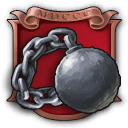
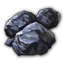
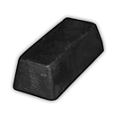
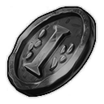
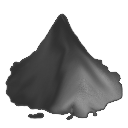
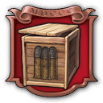
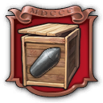
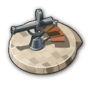
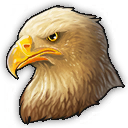
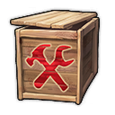

# Military Attention | BETA 0.1!

A mod centered around military infrastructure and adding new military residence tiers for all regions with a focus on the Old World.

## New population tiers

Added a new population tier at the construction menu called soldiers. This is done for every region.

Within those menus a lot of new buildings are available. With a focus on the Old World but also the New World, Arctic and Enbesa got some basic military love.

### Soldiers (Old World, New World, Enbesa, Arctic)

Adds a new soldiers population tier as extra workforce in every region.

#### Old World

##### Needs
- Canteen
- Bread
- Military Uniforms
- Basic Weapons
- Weapons
- Military Training Complex
- Coins
- Beef
- Military Headquarters
- Canned Food
- Coffee
- Military Academy

##### Luxury Needs
- Soap
- Horses
- Sanitation Facility
- Care Packages
- Cigarettes
- Recreation Center
- Sleeping Bags
- Socces Balls

##### Lifestyle needs
- Jam
- Shampoo
- Chewing Gum
- Lemonade

#### New World

##### Needs
- New World Outpost
- Canteen
- Military Uniforms
- Friend Plantains
- Basic Weapons
- Weapons
- Coins
- Canned Food

##### Luxury Needs
- Cigarettes
- Cardgames
- Baxing Arena
- Rum
- Care Packages

##### Lifestyle needs
- Beer
- Socces Balls
- Ice Cream

#### Arctic

##### Needs
- Arctic Outpost
- Caribou Meat
- Basic Weapons
- Weapons
- Coins
- Canned Food
- Post Office
- Care Packagaes

##### Heating Needs
- Canteen
- Wood
- Heated Military Uniforms
- Sleeping Bags
- Rum
- Cigarettes

##### Lifestyle needs
- Cardgames
- Huskies
- Gramophones

#### Enbesa

##### Needs
- Enbesa Outpot
- Canteen
- Military Uniforms
- Dried Meat
- Basic Weapons
- Weapons
- Coins
- Goat Milk

##### Luxury Needs
- Cigarettes
- Cardgames
- Musicians' Court
- Coffee
- Care Packages
- Canned Food

##### Lifestyle needs
- Seafood Stew
- Violins
- Fans

### Military Engineers (Old World)

Upgraded version of soldier residences. Military engineers are added to the normal engineers workforce pool.

##### Needs
- Military Headquarters
- Canteen
- Canned Food
- Coins
- Advanced Weapons
- Coffee
- Industrial Lubricant
- Cables
- Fire Extinguishers

##### Luxury Needs
- Recreation Center
- Care Packages
- Cigarettes
- Pocket Watches
- Telephones
- Gramophones
- Cognac
- Typewriters
- Military Academy

##### Lifestyle needs
- Spectacles
- Chocolate
- Fans
- Scooters

## New (military) buildings

### Residence Buildings

- Encampment (Old World, New World, Enbesa, Arctic)
- Barracks (Skyscraper variant of encampment for soldiers)
- Engineers Quarters

### Public Services

|     |  |
| -------- | ------- |
|   | Canteen (New World, Enbesa) |
|   | Sanitation Facility |
|  | Navy Recruitment Office  |
|  | Military Headquarters  |
|  | Military Outpost (New World, Enbesa, Arctic)  |
|  | Recreation Center  |
|  | Military Training Complex  |
|  | Military Post Box  |
|  | Propaganda Facility  |
|  | Military Prison  |
|  | Military Academy  |

### Production Buildings
|     |  |
| -------- | ------- |
|  | Stables  |
|  | Open Pit Iron Mine  |
|  | Open Pit Coal Mine  |
|  | Military Uniform Factory  |
|  | Basic Weapons Factory  |
|  | Care Package Factory  |
|  | Galena Module  |
|  | Lead Smelter  |
|  | Mint  |
|  | Paper Factory  |
|  | Cardgames Factory  |
|  | Cigarettes Factory  |
|  | Dung Collector  |
|  | Nitrary  |
|  | Gunpowder Factory  |
|  | Ammunition Factory (Basic)  |
|  | Ammunition Factory (Shell)  |
|  | Ammunition Factory (Bombs)  |
|  | Sleeping Bag Factory  |
|  | Heated Military Uniform Factory  |

### Logistic Buildings
|     |  |
| -------- | ------- |
|  | Small Ammunition Depot (Basic) (Old World, New World, Enbesa, Arctic)  |
|  | Small Ammunition Depot (Shell) (Old World, New World, Enbesa, Arctic)  |
|  | Small Ammunition Depot (Gas) (Old World, New World, Enbesa, Arctic)  |
|  | Small Ammunition Depot (Bombs) (Old World, New World, Enbesa, Arctic)  |
|  | Large Ammunition Depot (Old World, New World, Enbesa, Arctic)  |
|  | Small Military Warehouse  |
|  | Military Warehouse  |

### Defense Buildings
|     |  |
| -------- | ------- |
|  | Fort |

## New Goods
|     |  |
| -------- | ------- |
|  | Horses  |
|  | Military Uniforms (Wool + Steel) |
|  | Basic Weapons  (Wood + Steel) |
|  | Sailors |
|  | Cigarettes  (Paper + Hopps) |
|  | Galena |
|  | Lead (Coal + Galena) |
|  | Coins (Lead) |
|  | Cardgames (Paper + Wood + Quartz Sand) |
|  | Gunpowder (Coal + Saltpetre) |
|  | Basic Ammunition (Lead + Gunpowder) |
|  | Shell Ammunition (Steel + Gunpowder) |
|  | Sleeping Bags (Wool + Cotton Fabric + Fur) |
|  | Heated Military Uniform (Wool + Steel + Fur) |

## Additions to existing ships and buildings
- Added extra costs to **build ships**
    - Tradeships need care packages and sailors. Warships also need ammunition and basic weapons.
    - AI is also able to build ships with the new goods and also produces those new goods.
    - **!!!! TO DO !!!!**: Add compatibility with other ship mods so they also require the extra goods to build ships. List the mods that are supported.
- Added **ammunition mechanic to defense buildings** with an ammunition depot
    - Add the corresponding (Small Basic, Small Shell, Small Gas, Small Bombs or the large) ammunition depot next to the defense buildings so the debuff of -100% damage and range is countered by the depot ammunition buff.
    - AI does not use this mechanic and will not build those depots. Forcing them to use this mechanic would be impossible. They use the regular way of defense buildings.
    - In an existing savegame the regular defenses will still be there and work, and you will be able to copy them via the pipet. They will nog longer be in the building menu. If you want to play it fair, replace your existing defenses with the new versions in existing games.

## Sailors

Sailors is a new good that is used to build ships. 

Because it is not possible to add workforce to a ship (ships go cross region and workforce is tied to an island/region) but we wanted to add some additional workforce or complexity to ships this was the path we took. By adding sailors to the building costs, some form of workforce is needed to go on the ships.

Sailors are produced like mail is produced. You have to build a building with a radius inbetween your residences that generates a product based on the amount of residences in the radius. In this case it is the **Navy Recruitment Office**. It has its own storage capacity. 

AI are also able to build those so they are able to build ships with the additional input.

## Defense buildings & Ammunition depots

 
 
 
 

To make the defense buildings a bit more complex we added **workforce** and the **need of ammunition** to the buildings **in every region**.

Workforce was easily added. Although the workforce is technicly not needed and the building will also shoot with a shortage of workforce, it will drain the military workforce if you have other buildings relying on the military workforce which would then not work anymore in case of a shortage of workforce.

Processing ammunition was not so easily implemented. Ideally we would let the defense building process the ammunition itself. But that seems not possible because the defense building is a specific building type not able to process goods. Because of that we had to create a workaround and the Ammunition depots are a solution for that.

The ammunition depot is working like a multifactory/mall/restaurant. It processes a good (ammunition) and produces a buff in a radius. The defense buildings standard have a debuff of -1000% damage and range so they will actually not shoot anything and if they would shoot something it would not do any damage. The ammunition depot processes the ammunition and buffs the defense buildings with a counter buff of 1000& damage and range. 

More advanced defenses require more advanced ammunition. We have 4 types of ammunition and depots.
- Basic ammunition: Mounted Guns, Flak Emplacement and Flak Emplacement Land 
- Shell ammunition: Cannon Tower and Armor Pierce Tower
- Gas ammunition: Fire Tower
- Bombs ammunition: Monster Gun and Fort

We have 4 types of **small ammunition depots** to cover all types of ammunition.

We also have a **large ammunition depot**. This depot needs to be build on shore and buffs all types of ammunition but also requires all types of ammunition as input.

Last, but not least we have the unique **Fort**. A massive defense building build as a unique monument in different stages! Only in the Old World and unlocked at a later stage.

## Docklands

### Sinchester

For people who want to use Docklands, there is an extra trader available, **Sinchester**.

This trader specialises in weapons and ammunition.

Goods this trader sells:
- Basic Weapons (Uncommon)
- Military Uniforms (Uncommon)
- Weapons (Uncommon)
- Basic Ammunition (Rare)
- Shell Ammunition (Epic)
- Heated Military Uniforms (Epic)
- Arctic Gas (Legendary)
- Bombs (Legendary)

### Docklands tweaks

Apart from a new trader focused on weapons and ammunition we also added some other new products to existing traders.
- Tattershire Farms > Horses
- Old Levant & Co. > Cigarettes
- The Promise Trust > Gunpowder
- Qinsa Mining > Galena and Lead
- Ganymedia > Cardgames

## Items

At the moment a couple of items are created. The plan is to create more and also add new buildings to the pools of existing items. Still on the to do list but not breaking for the first testphase.

### Current new items

|     |  |
| -------- | ------- |
|  | **James Fondrick:** Cigarettes Factory - Using Tabacco instead of hopps with additional output  |
|  | **Theodore Von Woudenburg:** Window Makers - Using Lead instead of Wood with additional output  |

### New items for Academy sets

We also have a new building where you can collect sets of items. Like the zoo, museum, botanical garden but with sets focused on logistics and military. To make it interesting we added items that can only be obtainable by destroying pirates (Anne and Jean). Some of the items are taken from existing items, but also a couple of new items were created.

|     |  |
| -------- | ------- |
|  | Pirate Naval Architect Blueprints  |
|  | Jean's Best Whisky  |
|  | Anne's Eagle  |
|  | Pirate Repair Tools  |
|  | Pirate Taxman  |
|  | Pirate Wanted Poster  |
|  | Pirate Treasure Chest  |
|  | Jean's Private Messenger  |

## New monument, the Fort

At the moment there is 1 new monument you will be able to build in multiple stages with this mod, the **Fort**. This is a unique massive coastal defense building for the Old World. You can only build it on 1 island and only in the moderate region (Old World or Cape Trelawney). 

The model and animations and feedback for this building still need a lot of improvement, but the basic mechanics should already work.

## Vanilla tweaks

### Balancing to **existing buildings**
- Changes (building/maintenance) costs vanilla buildings
    - Sailmakers (Removed Bricks building cost) 
    - Furnace (Money: 100 > 50 | Workforce: 100 > 50) 
    - Steelworks (Money: 200 > 100 | Workforce: 200 > 100) 
    - Weapon Factory (Money: 150 > 80 | Workforce: 50 > 40) 
    - Sand Mine (Money: 120 > 50 | Workforce: 25 > 25) 
    - Glassmakers (Money: 100 > 50 | Workforce: 100 > 50 ) 
    - Window Makers (Money: 200 > 100 | Workforce: 100 > 50 ) 

- Change input production vanilla **chain**
    - Weapon Factory (Add wood)

- Add needs to vanilla **population**
    - Farmers (Potatoes, Horses)
    - Workers (Potatoes, Cigarettes)
    - Artisans (Cigarettes)
    - Scholars (Cigarettes)
    - Explorers (Cigarettes)
    - Technicians (Cigarettes)

- Reduction amount of **farmfields**
    - Potato Farm (72 > 42)
    - Hop Farm (96 > 66)
    - Grain Farm (144 > 90)
    - Red Pepper Farm (108 > 78)

## AI tweaks

It is a military mod, and because we added some additional mechanics we had to make sure the AI could still build everything and progress to the next tier. At the moment AI does not build all the new buildings. For example, they do not make encampments fom soldiers. Because of that we had to find some workarounds so they would actually keep progressing and still were able to build everything and still being a thread for the player. You will see the AI build some of the new buildings, but not all of them. 

In newer versions we maybe would tackle more AI advancements and buildings but for now they still progress and be a thread. Testing this and reporting bugs with the AI is appreciated! Do not hesitate to report problems you encounter with the AI!

### Tweaks we made for AI
- We created duplicate buildings for AI so they would actually make some of the goods that are needed for making ships
    - Care Packages
    - Basic Weapons
    - Basic Ammunition
    - Shell Ammunition
    - Bombs Ammunition
    - Sailors
- We added the goods to the list of materials the AI is forced to build. The harder the AI, the more they will build of those making them progressing faster and stronger.
- We added the new buildings for AI and the vanilla defense buildings to the construction menu but in a hidden state, so only AI can see and use them.
- We removed all the vanilla defense buildings from the building menu
- Because AI can still use the vanilla defense buildings, they do not use the ammunition depot mechanic. Defense buildings of the AI work without it.

## Tweaks for other mods

To be able to play this mod together with other mods and also strengthen eachother, I added some compatibility between a couple of mods.

### Combat Overhaul
[Combat Overhaul on mod.io](https://mod.io/g/anno-1800?_q=Combat+Overhaul)

One of the most and liked mods for Anno 1800. The new ships made from this mod now need the additional building costs.

### World War Ships
[World War Ships on Patreon](https://www.patreon.com/WorldWarShip)

When shown in preview people were getting crazy. Those massive ships added a whole new level of combat. This mod is compatible and new building costs are added to the ships.

### Safari to Old Enbesa
[Safari to Old Enbesa on mod.io](https://mod.io/g/anno-1800/m/safari-to-old-enbesa-lion053)

Ships in Enbesa! Made them compatible and added the extra costs. I also had to make sure sailors could reach Enbesa because this is a different type of product that normally is not transportable to Enbesa.

### Imperio Shipyard
[Imperio Shipyard on mod.io](https://mod.io/g/anno-1800/m/imperio-shipyard)

A huge collection of ships based on existing models. All those ships now need additional building costs.

## Still on the to do list
- Translations for all languages. If anyone wants to translate! Would be amazing!
- Models for Navy Recruitment Offices other regions
- Adding feedback units and animations to all new buildings
- Redoing a lot of the materials of the new buildings so they are not so shiny
- Cleanup ammunition depot code
- More military items for military production buildings or add buildings to existing itempools
- Festivals
- Newspaper additions when unlocking something or being at a certain stage
### Nice to haves that probably will never be done...
- Expeditions
- Quests

## What if you want to test?

### Reporting a bug
When reporting a bug please provide the following information:
- Existing game or new game?

### Things to provide feedback for
- Balanced?
    - Population
    - Income
    - Upkeep
    - Needs
    - Defenses
    - Buffs
    - Ships
    - New mechanics of sailors and ammunition
- Policies/buffs make sense?
- New mechanics of sailors and ammunition are clear enough? 

## FAQ

### This is a military mod, why no land combat?
Land combat is not something easily modded into the game. When modding we bend the already existing mechanics from the game into new gameplay of functions. Land combat is a mechanic we can not implement without some functionality from the game itself. That functionality is not there. So we can not really implement land combat into something that is not existing.

### Why no land defenses for all defenses?
Land defenses can create troubles. The most important problem occurs when they are put inland. Ships from AI will try to attack them, resulting in ships getting bugged out and stuck on shores. If we disable this so ships do not attack them, that is even worse because then there is no counter to those cannons and they can not be destroyed by ships, but those cannons can shoot on ships. We only choose to do this for the flak cannon because that cannon can only attack airships and so, not bugging out normal ships. We can set the building to only be attackable by bombing them which can only be done by airships who are in the end also the only ships those flak cannons can attack.

### Why are there no new ships?
At first I was planning to make some new ships for this mod, after all, this is a military centered mod. But this mod took a while to make and at a certain stage other people were starting to make amazing new shipmods and even at a level I would never be able to top. So, I decided not to make any new ships. If you want extra ships use the other amazing already existing shipmods. **Combal Overhaul**, **World War ships**, **Imperio Shipyard** and even the **Enbesa Safari** mod has amazing ships ready to use. Those are some of the mods I also added compatibility for so you have extra costs to build them.  

